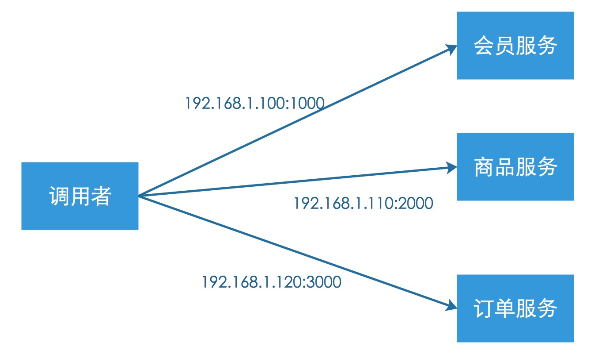
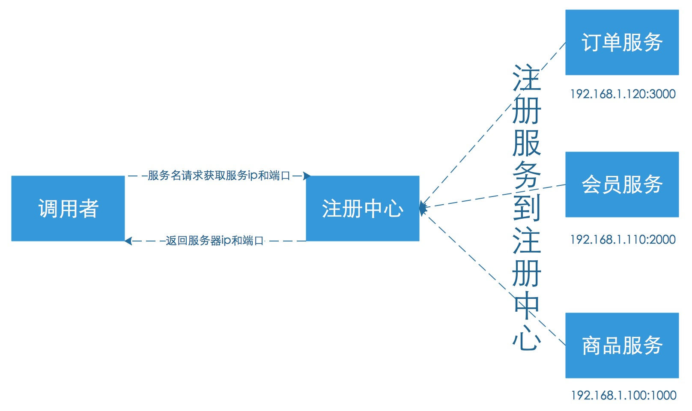

# Consul服务器配置

微服务带来最大的好处就是把整个大项目分割成不同的服务，运行在不同服务器上，实现解耦和分布式处理。微服务虽然有很多好处，但是也会有不好的一方面。任何事物都会有两面性，在微服务里面运维会是一个很大的难题，如果有一天我们的服务数量非常的多，然后我们又不知道哪一个服务在什么机器上。可能会有人说这部分直接写在程序的配置里面就好了，当我们服务少的时候是可以这么做的，也允许这么做，但是在实际当中我们要尽量避免这么做，比如说我们某一个服务，地址换了，那么我们设计的相关代码就得修改重新部署；又或者说我们有一天上线一个新服务或者下线一个服务，这时候我们又得修改程序代码，这是非常不合理的做法。那么有没有什么可以解决这样的问题呢？这里就需要用到我们的服务注册和发现了。

## 结构对比

### 没有服务注册发现的结构



<center>没有服务发现的架构</center>

上面图片我们可以看到在没有服务注册发现的时候一个调用者需要维护多个服务的ip和端口，这是非常不好的做法，当我们服务进行调整的时候就有可能导致服务调用失败，还有服务器更换服务器，上下新服务，都会受到影响。将来某一个服务节点出现问题，排查对于程序和运维人员来说都是一场很大的灾难，因为不知道哪一个节点出了问题，需要每一台服务器的去排查。

而当我们有使用服务注册发现之后的结构体是什么样子的呢？

### 有服务注册发现的结构



<center>有服务注册发现的结构</center>

我们从上图可以发现，当我们有注册中心之后调用者不需要自己去维护所有服务的信息了，仅需要向注册中心请求获取服务，就可以拿到想要的服务信息。这样当我们的服务有所调整，或者上线下线服务，都要可以轻松操作，并且可以在注册中间检查到服务的健康情况，帮助运维人员快速定位到故障的服务器。

### 关于 Consul

Swoft 推荐使用的就是 Consul，Consul是一个使用go写的服务注册、发现、配置管理系统。

* Agent：Agent是Consul集群中一个常驻后台的程序。Agent有两种模式，一种是服务端，一种是客户端。所有Agent都可以运行DNS或者HTTP接口，并且负责检查服务是否存活，和保持服务同步。

* Client：Client是一种Agent的运行模式，把所有RPC转发到Agent服务器的代理者，客户端会在后台有一个用最小带宽消耗把请求转发到后端的Agent服务，减轻Agent服务器的压力。

* Server：Server是另一种Agent的运行模式，包括使用Raft算法处理数据，维护集群状态，响应RPC的请求，与其他集群的server交换数据或者远程数据中心。

* RPC：远程过程调用，这是一种允许客户端发出服务器请求的请求/响应机制。

以上是我们本次比较重要的一些概念性的东西。知道每一个组件每一个部分干嘛的我们看以下的配置才会简单，才会事半功倍。

在 Consul 里面有很多组件，在这里我们暂时使用一个组件就够了就是agent，对于 Consul 的安装也是非常简单的毕竟只有一个二进制文件包，所以直接下载就可以使用了。

## 安装步骤

1、登录官网进行下载，[下载地址](https://www.consul.io/downloads.html)

```shell
wget https://releases.hashicorp.com/consul/1.2.1/consul_1.2.1_linux_amd64.zip
unzip consul_1.2.1_linux_amd64.zip
```

2、设置环境变量，如果不设置可以直接把consul执行文件移动到/usr/bin目录下

```shell
mv consul /usr/bin
```

ok, 安装成功后，我们接下来进行一些配置来启用consul

## Server配置

### 单机配置

- **服务器1，IP 192.168.1.100**

> 这种方式适合用于搭建服务调试使用

```shell
consul agent -bootstrap-expect 1 -server -data-dir /data/consul -node=swoft01 -bind=0.0.0.0 -config-dir /etc/consul.d -enable-script-checks=true -datacenter=sunny -client=0.0.0.0 -ui
```

可以通过 http://192.168.1.100:8500 查看服务信息

### 集群配置

> 这种方式适用于生产环境

- **服务器1，IP 192.168.1.100**

```bash
consul agent -bootstrap-expect 2 -server -data-dir /data/consul -node=swoft01 -bind=0.0.0.0 -client=0.0.0.0 -config-dir /etc/consul.d -enable-script-checks=true -datacenter=sunny -client=0.0.0.0
```
上面这个命令是以服务端模式启动一个代理，进群有两个扩展机器，设置集群持久化数据存放在/data/consul0下面，节点名称是swoft01，绑定0.0.0.0地址，服务配置文件存放在/etc/consul.d，开启检查心跳，数据中心的名称是dc1，可访问的客户端地址是0.0.0.0

- **服务器2，IP 192.168.1.110**

```bash
consul agent -server -data-dir /data/consul -node=swoft02 -bind=0.0.0.0 -client=0.0.0.0 -config-dir /etc/consul.d -enable-script-checks=true -datacenter=sunny -join 192.168.1.100
```

- **服务器3，IP 192.168.1.120**

```bash
consul agent -server -data-dir /data/consul -node=swoft03 -bind=0.0.0.0 -client=0.0.0.0 -config-dir /etc/consul.d -enable-script-checks=true -datacenter=sunny -join 192.168.1.100
```

以上服务器2和服务3使用 `-join` 加入集群，并且使用同一个数据名称 sunny

## Client配置

- **服务器4，IP 192.168.1.130**

```bash
consul agent -ui -data-dir /data/consul -node=swoft04 -bind=0.0.0.0 -config-dir /etc/consul.d -enable-script-checks=true -datacenter=sunny -ui -client=0.0.0.0 -join 192.168.1.100
```

客户端如果不使用-server就是客户端模式运行，其他参数同上，服务端和客户端都启动了之后可以在浏览器输入 http://192.168.1.130:8500 来查看信息

查看集群成员:

```bash
consul members
```

查看集群信息:

```bash
consul info
```

## 命令解析

更多[命令解析](https://www.consul.io/docs/agent/options.html)

* `-bootstrap-expect` 数据中心中预期的服务器数。不应提供此值，或者该值必须与群集中的其他服务器一致。提供后，Consul将等待指定数量的服务器可用，然后引导群集。这允许自动选择初始领导者。这不能与传统-bootstrap标志一起使用。此标志需要在服务端模式下运行。
* `-server` 以服务端模式启动
* `-data-dir` 数据存放位置，这个用于持久化保存集群状态
* `-node` 群集中此节点的名称。这在群集中必须是唯一的。默认情况下，这是计算机的主机名。
* `-bind` 绑定服务器的ip地址
* `-config-dir` 指定配置文件服务，当这个目录下有 .json 结尾的文件就会加载进来，更多配置可以参考 [配置模版](https://www.consul.io/docs/agent/options.html#configuration_files)
* `-enable-script-checks` 检查服务是否处于活动状态，类似开启心跳
* `-datacenter` 数据中心名称
* `-client` 客户端可访问ip，包括HTTP和DNS服务器。默认情况下，这是“127.0.0.1”，仅允许环回连接。
* `-ui` 开启web的ui界面
* `-join`加入到已有的集群中

关于consul更多的信息请大家移步到 [Consul官网](https://www.consul.io)
